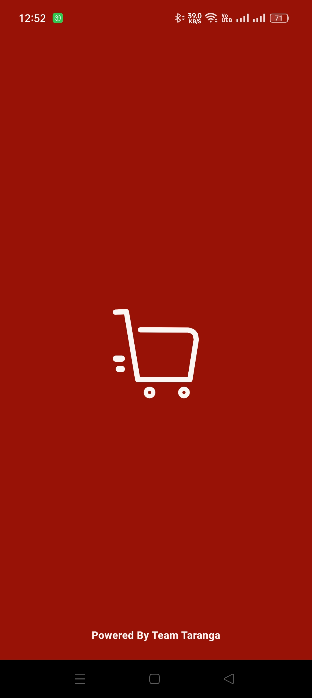
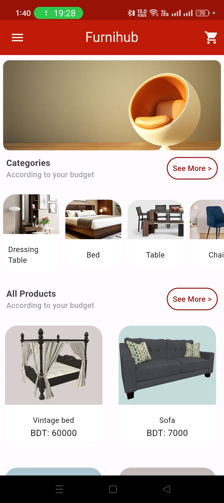
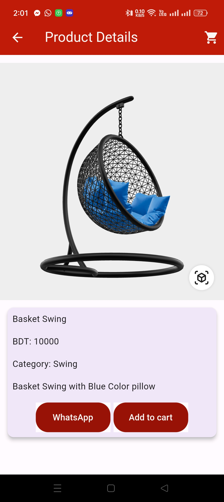
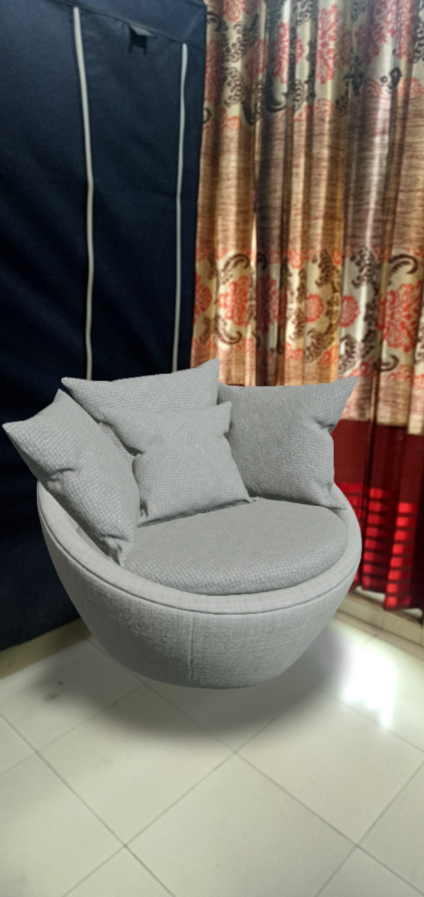
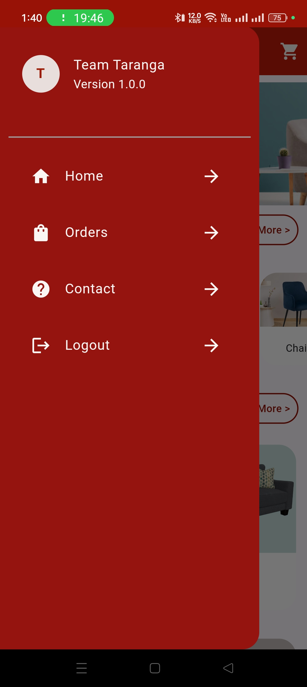

# Furnihub

Furnihub is an innovative e-commerce Android application developed using Flutter, allowing users to explore and purchase furniture. The app features augmented reality (AR), enabling users to visualize furniture in their living space before making a purchase. With a clean and intuitive interface, users can authenticate through Google or email, receive push notifications, and enjoy seamless interaction with Firebase backend services.

## Table of Contents

- [Features](#features)
- [GIFs](#gifs)
- [Screenshots](#screenshots)
- [Contact](#contact)

## Features

- **Augmented Reality (AR)**
  - View furniture in your room using AR before purchasing.

- **User Authentication**
  - Google Authentication
  - Email Authentication

- **Notifications**
  - Push Notifications for order updates and promotions.

- **Backend Services**
  - Firebase Firestore for data storage
  - Firebase Authentication
  - Firebase Cloud Messaging for push notifications

## GIFs

Check out the video showcasing Furnihub in action:

## Screenshots

Here are some screenshots from the app, arranged to show various features and pages:

### Onboarding and Authentication Screens
<table>
  <tr>
    <td></td>
    <td></td>
  </tr>
  <tr>
    <td style="text-align: center;">Splash Screen</td>
    <td style="text-align: center;">Login With Google</td>
  </tr>
</table>

### Main Features
<table>
  <tr>
    <td></td>
    <td></td>
    <td></td>
  </tr>
  <tr>
    <td style="text-align: center;">Home Screen</td>
    <td style="text-align: center;">Product Details Screen</td>
    <td style="text-align: center;">AR Furniture View Screen</td>
  </tr>
</table>

### Drawer and Contact Screen
<table>
  <tr>
    <td></td>
    <td></td>
  </tr>
  <tr>
    <td style="text-align: center;">Drawer</td>
    <td style="text-align: center;">Contact Screen</td>
  </tr>
</table>

## Contact

For any questions or suggestions, please contact [sakibsanto57@gmail.com](mailto:sakibsanto57@gmail.com).

## Project Report

For more details about the project, you can [preview the Furnihub Final Project Report](./FurniHub_Final_Project_Report_210041209_210041232_210041262.pdf) directly.

